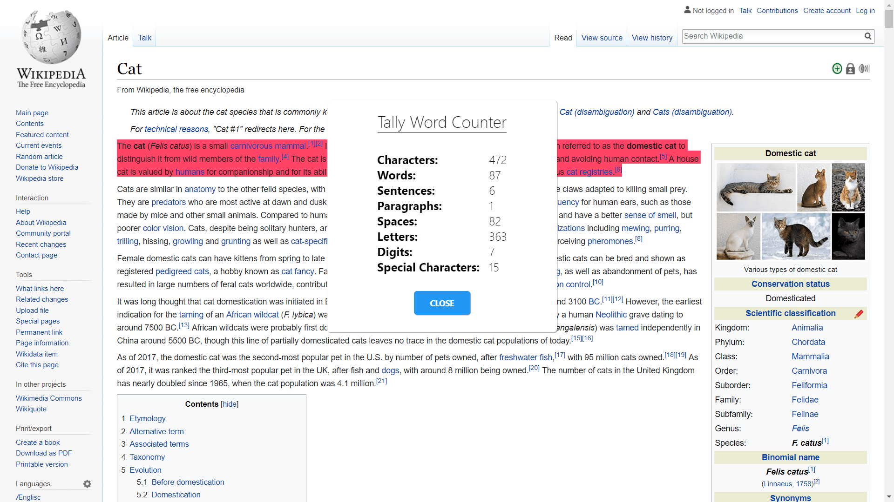

<!-- Project Header -->

  

  <h1 class="projectName">Tally</h1>

  

    
    
    
    
    
  

  
  

    A Chrome extension to easily count the number of words, characters, and paragraphs on any site
  

  
   

## Installation
The extension can be installed from the Chrome Web Store [here][1].

If you wish to build yourself, `build.sh` is used to copy all files to the `build/` directory, compile css, and zip the extension. You can do this any other way you wish. [SASS](https://sass-lang.com/) is used for CSS compilation. After running `build.sh`, the build directory can be loaded into Chrome.

## Usage
Select a block of text on any site, right click, and choose `Tally Word Counter: Count` in the context menu. The number of characters, words, sentences, paragraphs, spaces, letters, digits, and special characters will be shown.

## Screenshots
Desktop site | &#8291;
:-:|:-:
 | 
 | 

## Contributing
Contributions, issues, and forks are welcome but this is a hobby project so don't expect too much from it. [SemVer](http://semver.org/) is used for versioning.

## License
This project is licensed under the MPL 2.0 License. See [LICENSE][2] for details.

[1]: https://chrome.google.com/webstore/detail/tally-word-counter/eggkmbghbmjmbdjloifaklghfiecjbnk
[2]: LICENSE
